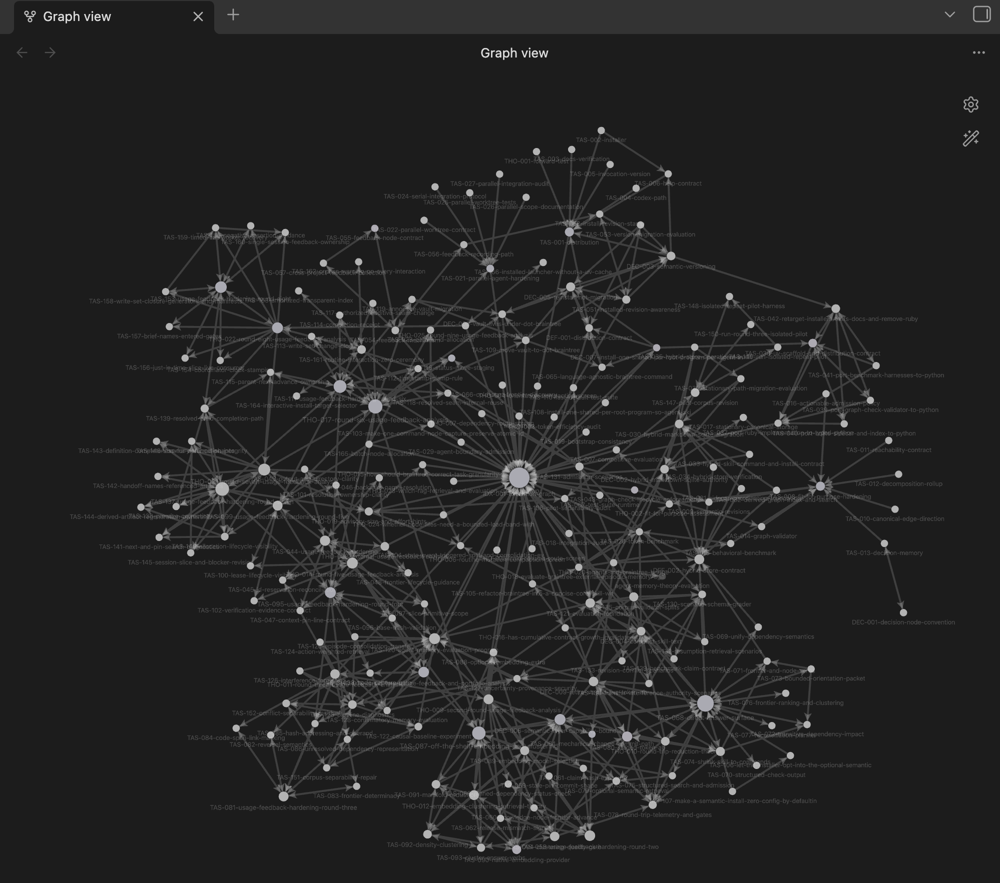

# Braintree

<p align="center">
  
</p>

Braintree keeps execution memory in a repository-local Markdown graph. Tasks,
decisions, definitions, blockers, and dependency state remain readable in Git and
Obsidian. An optional local sidecar provides faster queries and same-host
coordination.

The scope is deliberately narrow. Braintree is not a general note-taking system or
a replacement for a hosted issue tracker. Markdown remains authoritative, local
coordination is limited to one host, and semantic suggestions are advisory.

## Why it exists

Long-running engineering work tends to lose the reasoning between commits and chat
threads. Braintree records enough durable context to answer a few practical
questions:

- What should happen next?
- What is unfinished or blocked?
- Which decision or definition does this work depend on?
- Which consumers became stale when that context changed?

The result is ordinary Markdown. It can be reviewed, searched, merged, and repaired
without a service or a database.

## The model

Each concern is a small node in `.braintree/`:

```text
.braintree/
  index-map.md
  proposed/
  active/
  blocked/
  resolved/
```

The directory supplies status, the filename supplies stable identity and type, and
wikilinks supply graph relationships. Every non-root node has one primary `Parent`
or `Area` link that reaches a root hub. Relationships are stored in one direction;
backlinks and inverse views are derived by search.

<p align="center">
  
  <br>
  <em>This repository's own <code>.braintree/</code> vault visualized in Obsidian Graph view.</em>
</p>

A node carries a semantic `context_rev`. Consumers pin the revision they used, so a
meaningful change can make stale assumptions visible without treating every edit as
a semantic change.

Nodes are execution memory, not a work log. Keep decisions, reusable context, and
work that will matter when someone resumes later. Leave out transcripts, routine
status, copied source material, and mechanical cleanup.

One node owns one durable outcome or decision. A node is not sized to a session,
commit, agent, or amount of code; one node may span sessions and one session may
advance several nodes. Reassess that boundary only when execution reveals evidence.
Split or consolidate around outcomes that can be accepted, verified, consumed,
blocked, or resumed independently, never merely because a session ended, an agent
changed, several commits landed, or the work was larger than expected. Similarity,
clustering, and digest results can inform that judgment, but no checker or command
has semantic authority over scope.

## Install

Clone this repository and run the installer with no arguments. It installs the
shared `braintree` command and the Codex, Claude Code, and pi skills into your
home root, so `~/.local/bin/braintree` is ready with no configuration:

```sh
./scripts/install.sh
```

An explicit agent or destination narrows that. Omitting the agent installs all
three; omitting the destination uses `$HOME`:

```sh
# pi, project scoped
./scripts/install.sh --pi --project /path/to/project

# Claude Code, project scoped
./scripts/install-claude.sh --project /path/to/project

# Codex, user scoped
./scripts/install.sh --codex --home "$HOME"
```

Pass `--select` to discover the enclosing project root and the home root and
choose targets from a numbered multi-select instead. `--select` needs a terminal
(or `BT_INSTALL_SELECTION`). Use `--dry-run` to inspect a destination without
writing it. Add the generated `<root>/.local/bin` directory to `PATH`, then
restart the relevant agent so it can discover the skill.

Invoke the skill as `$braintree` in Codex, `/braintree` in Claude Code, or
`/skill:braintree` in pi when automatic selection is not enough.

## Everyday use

Start or inspect a vault:

```sh
braintree init
braintree orient
braintree frontier
braintree node TAS-101
braintree impact DEF-auth-protocol
```

Validate Markdown and rebuild the optional local index:

```sh
braintree check
braintree index
braintree search 'authentication' --limit 10
```

Capture feedback from a consuming project:

```sh
braintree feedback record \
  --attempted '...' --friction '...' --improvement '...'
```

Run `braintree --help` for the command index or `braintree <verb> --help` for one
command. The installed topical references contain the workflow contracts:

- [`references/change-intake.md`](references/change-intake.md) covers the opt-in
  sealed-proposal, reconciliation, acceptance, and recovery protocol.
- [`references/authoring.md`](references/authoring.md) covers node bodies,
  admission, decomposition, and feedback.
- [`references/dependencies.md`](references/dependencies.md) covers pins, gates,
  revision changes, and reconciliation.
- [`references/coordination.md`](references/coordination.md) covers claims, leases,
  worktrees, handoffs, and integration.

`SKILL.md` is the concise agent entry point. `.braintree/` is the source of truth for
this repository's own work.

## Optional local capabilities

The sidecar is derived and disposable. It stores indexes, leases, and atomic ID
reservations outside the repository. All worktrees for one Git repository share it.
Losing it does not lose graph content; `braintree init` and `braintree index` rebuild
the derived state. SQLite coordination assumes one host and a local filesystem.

Semantic retrieval and clustering require the optional extra. An installer
requests it with `--semantic`, which materializes it into the shared program
and its generated launcher; a package consumer can install the `semantic`
extra from the package index (`braintree[semantic]`). Queries remain offline
and require model weights in `BT_MODEL_CACHE` or the usual Hugging Face cache.
A missing extra or model, or an unhealthy provider, falls back to the lexical
baseline.

The default model is `sentence-transformers/all-MiniLM-L6-v2`, with
`BAAI/bge-small-en-v1.5` as fallback. The measurements do not show a universal win
over lexical search, so semantic ranking stays optional. Clustering, outlier reports,
and boundary suggestions are also advisory.

See [`benchmark/embedding-evidence.json`](benchmark/embedding-evidence.json) and
[`benchmark/clustering-quality-evidence.json`](benchmark/clustering-quality-evidence.json)
for the recorded measurements.

## Development and evidence

Run the fast offline suite before committing:

```sh
make test
```

Benchmark verification is opt-in:

```sh
make test-benchmarks
```

[`BENCHMARK.md`](BENCHMARK.md) documents the worktree checks, graph-size comparisons,
token experiments, and their limits. The [`research/`](research/) directory contains
the memory-evaluation designs and reports.

The graph format is Obsidian-compatible Markdown. The broader skill convention comes
from the [Agent Skills specification](https://agentskills.io/specification), and
Claude Code's discovery rules are documented by
[Anthropic](https://docs.claude.com/en/docs/claude-code/skills).
